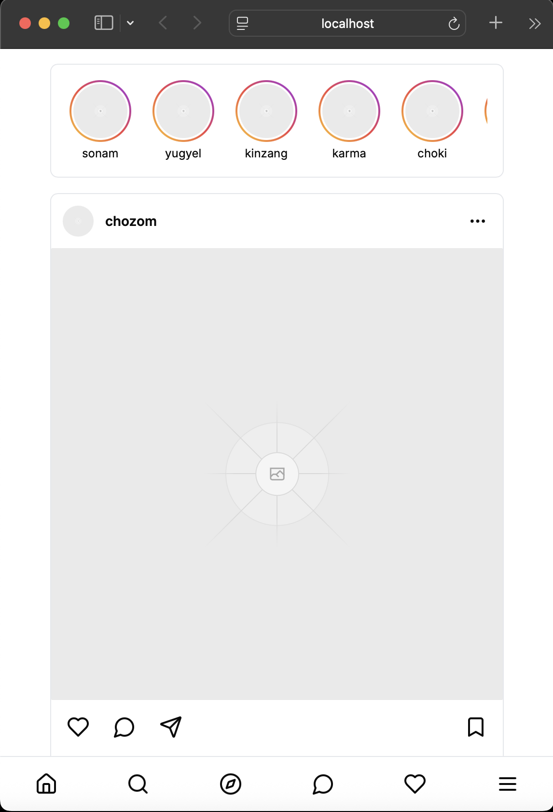
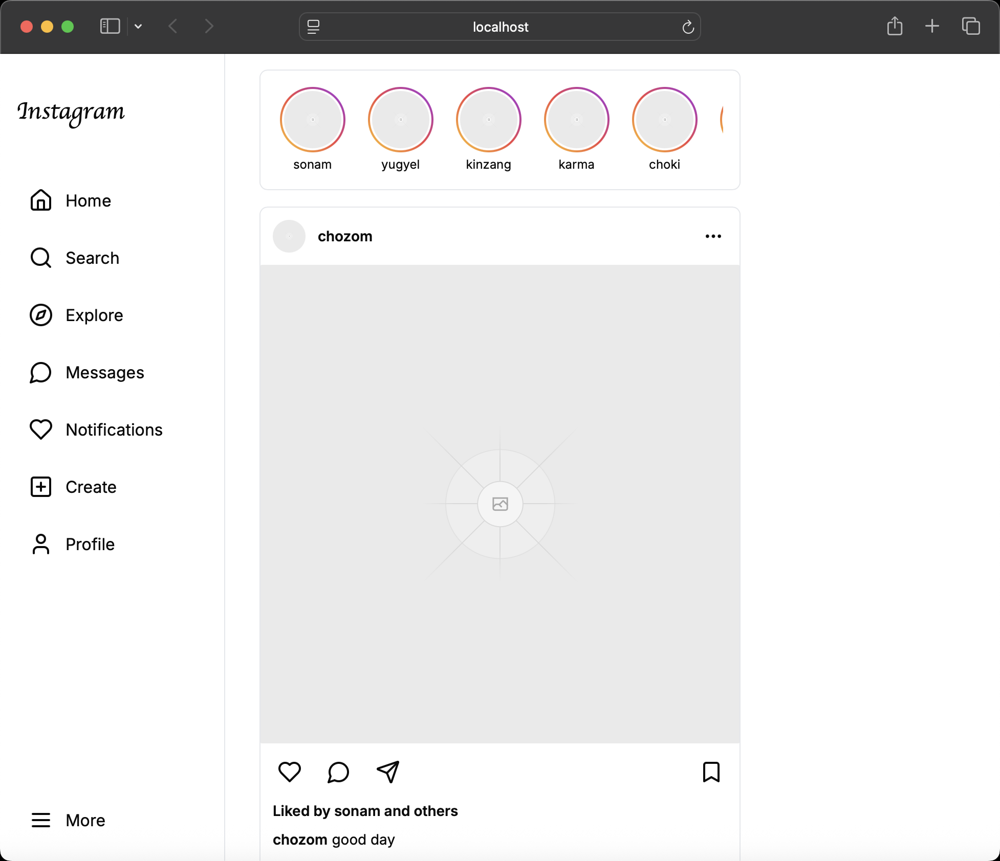
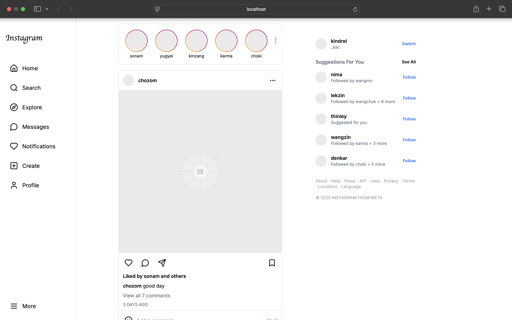

# Instagram Clone

This project is a React.js implementation of the Instagram homepage, created as part of a practical assignment to demonstrate understanding of modern front-end development techniques and React principles.

## Project Overview

This Instagram clone recreates the main homepage of Instagram, including:
- Navigation sidebar
- Stories bar
- Feed with posts
- Suggestions sidebar
- Responsive design for mobile, tablet, and desktop views

## Component Structure

The application is built using a component-based architecture, breaking down the UI into reusable components:
```
instagram-clone/
├── app/
│   ├── layout.tsx        # Root layout component
│   ├── page.tsx          # Main page component
│   └── globals.css       # Global styles
├── components/
│   ├── sidebar/
│   │   └── sidebar.tsx   # Navigation sidebar component
│   ├── stories/
│   │   ├── stories-bar.tsx  # Container for story circles
│   │   └── story-circle.tsx # Individual story circle
│   ├── post/
│   │   ├── post.tsx         # Main post component
│   │   ├── post-header.tsx  # Post header with username and avatar
│   │   ├── post-content.tsx # Post images/carousel
│   │   ├── post-actions.tsx # Like, comment, share buttons
│   │   ├── post-caption.tsx # Caption and metadata
│   │   └── post-comment-input.tsx # Comment input field
│   ├── feed/
│   │   └── feed.tsx      # Main feed component
│   └── suggestions/
│       ├── suggestions.tsx    # Suggestions sidebar
│       └── user-suggestion.tsx # Individual user suggestion
└── public/
└── placeholder images
```
### Component Hierarchy
```
Page
├── Sidebar
├── Feed
│   ├── StoriesBar
│   │   └── StoryCircle (multiple)
│   └── Post (multiple)
│       ├── PostHeader
│       ├── PostContent
│       ├── PostActions
│       ├── PostCaption
│       └── PostCommentInput
└── Suggestions
└── UserSuggestion (multiple)
```

## Data Sources

For this demonstration, the application uses static data objects to simulate the content:

- `storyData`: Array of user stories
- `postData`: Array of posts with images, captions, and metadata
- `suggestionData`: Array of suggested users to follow

In a real application, these would be fetched from an API.

## Responsive Design

The application is fully responsive:

- **Mobile**: Bottom navigation bar, full-width feed
- **Tablet**: Side navigation, full-width feed
- **Desktop**: Side navigation, centered feed with suggestions sidebar

## Technologies Used

- **Next.js**: React framework for building the application
- **Tailwind CSS**: For styling components
- **Lucide React**: For icons
- **TypeScript**: For type safety

## Implementation Details

### Key Features

1. **Component Reusability**: Components like `StoryCircle`, `Post`, and `UserSuggestion` are designed to be reusable with different data.

2. **Responsive Layout**: The layout adapts to different screen sizes using Tailwind's responsive classes.

3. **Interactive Elements**: Like buttons, comment input, and image carousel are fully interactive.

4. **Type Safety**: TypeScript interfaces are used for component props to ensure type safety.

### Single Responsibility Principle

Each component has a single responsibility:
- `Post` handles the overall post structure
- `PostHeader` only manages the user info section
- `PostContent` manages the image display and carousel
- `PostActions` handles the interaction buttons

## Mobile Responsiveness

The application is responsive across:
- Mobile phones 



- Tablets 



- Desktops



## Future Improvements

- Add authentication functionality
- Implement dark mode
- Add real-time notifications
- Connect to a backend API for dynamic data
- Add story creation and viewing functionality
- Implement search functionality

## Learning Outcomes

This project demonstrates:
- Breaking down a complex UI into reusable components
- Implementing responsive design with Tailwind CSS
- Using TypeScript for type safety
- Managing component state with React hooks
- Creating an accessible and user-friendly interface